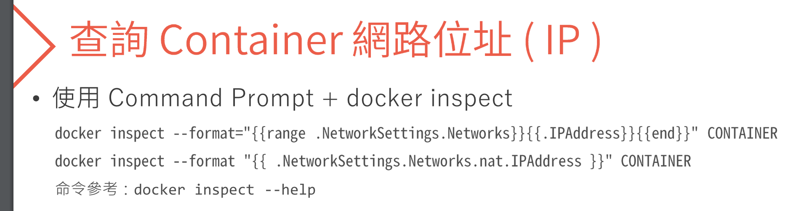

# 容器化技術概念介紹與實作

#### 容器是什麼？
vm 硬體資源利用最大化
容器化： 程式包成 container image (就像ＩＳＯ檔案)
包含 runtime, system setting, main program
run 起來之後的檔案在容器刪掉之後都會不見，例如: LogFile 產生檔案，上傳檔案之類的服務
更版的時候 image 裡面的檔案都會不見，sln-> 設定對應的實體硬碟，檔案就會丟過去
主程式結束，docker就結束，如果裡面有其他程式在跑，不會知道
‘執行中的 container 可以轉成 image’
容器技術 is 輕量虛擬化 作業系統 
無狀態 永遠不會更新

#### 微服務
將系統切分成小項目container image，彼此用 API 做溝通
複雜性變高 >> 自動化 > 無狀態～
如果要有狀態的，就獨立出來一個 Services 給大家做使用(例如 File Upload download)

#### docker
--rm 主程式 停掉就刪除
attach 加檔案
exec 執行容器內某一程式
指定 主程式
-d 背景
-p 8080:80  本機 8080 對應至 docker 80 
-e Default_connection=123 設定環境變數
logs + id   看log
ps -a   
-v 掛載本機磁碟 -v G:\Project:/Project 
control-p  control-q 退出容器不停止
--restart=always 容器永遠執行
-P 所有的 port 都掛上去

#### 軟體部署
可動態 改變不同設定、新增功能 《組態飄移》
利用微服務架構來 ‘分類’及‘管理’

#### 主從式架構
client 透過 restapi 呼叫 docker deamon (docker host)

 
執行container 裡面的 bash
 docker exec -it ContaineriID bash
安裝 apt & cowsay
 apt update && apt-get install cowsay -y
執行 cowsay
 cowsay

 #### 檔案
 兩個docker 共用檔案伺服器
 docker 只讀
 docker 只寫

 #### 反向代理
ect > nginx > conf.d >  default.conf

    location / {
        proxy_pass https://www.skl.com.tw;
        proxy_set_header Host www.skl.com.tw;  
    }

建立 nginx 80 對應至本機 8080 
 docker run --name myng -it -d nginx:latest -p 8080:80

重啟伺服器
 docker exec -it containerid nginx -s reload

#### 網路環境
 

espanso

#### docler cp

docker cp /Users/hansjiang/Project/DockerSession/ /ubuntu:Temp
docker cp TEMP ubuntu:/TEMP
/Users/hansjiang/Project/DockerSession/

#### docker create 
只建立容器但是不跑他
還是可以 cp 檔案出來

