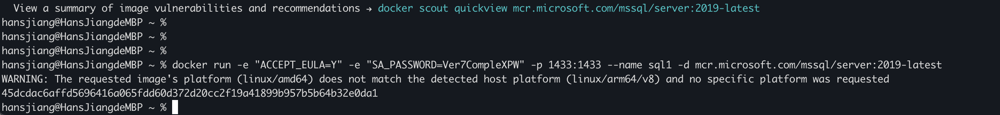

# 下載 SQL Server 2019 Linux 容器映像
docker pull mcr.microsoft.com/mssql/server:2019-latest

# 啟動 SQL Server 2019 Linux 容器
docker run -e "ACCEPT_EULA=Y" -e "SA_PASSWORD=Ver7CompleXPW" -p 1433:1433 --name sql1 -d mcr.microsoft.com/mssql/server:2019-latest

docker run --platform linux/x86_64 -e "ACCEPT_EULA=Y" -e "SA_PASSWORD=Ver7CompleXPW" -p 1433:1433 --name sql1 -d mcr.microsoft.com/mssql/server:2019-latest

# 查看 SQL Server 2019 Linux 容器啟動記錄是否有異常
# 看到 SQL Server is now ready for client connections. 訊息就代表沒問題！
docker logs sql1

# 進入容器環境
docker exec -it sql1 "bash"

# 進入 sqlcmd 命令列環境
docker exec -it sql1 /opt/mssql-tools/bin/sqlcmd -U SA -P Ver7CompleXPW -W