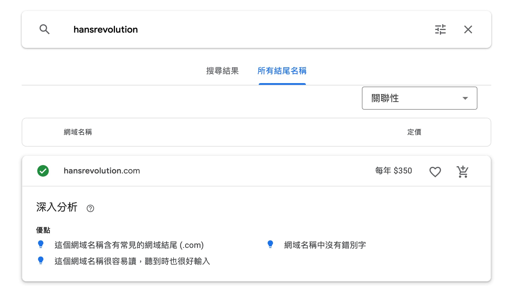
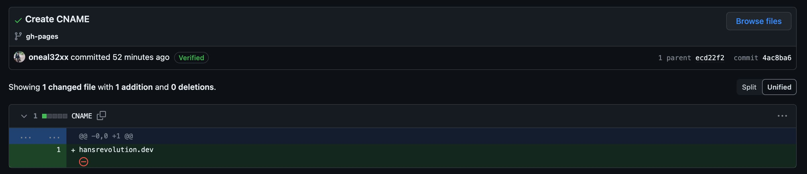

## Docusaurus 使用 Google Domain & GitHub Pages 自定義網域

### Google Domain 申請及購買

首先到 Google Domain 收尋自己想要的域名

找到自己想要的網域結尾，就可以加入購物車去付款啦！

結帳的時候 Google 會跟你說 隱私保護服務已啟用，這部分直接打勾即可，接者就可以拿起你的魔法小卡給他刷下去了！
`隱私保護服務已啟用`
`系統不會公開顯示你的聯絡資訊。為協助保護個人資訊並防範垃圾內容，第三方會在 WHOIS 目錄中為網域提供替換聯絡資訊，你無須額外付費。`

### Google Domain DNS 設定

購買完 Domain 之後就要將這個 Domain 指向 GitHub Pages，這邊需要參考 GitHub Docs 的文件，文件告訴我們要在 Google Domain 的 DNS 設定新增 A record，
如果要支援 IPv6，就要設定 AAAA records，我們這邊只需要設定 A record 就 OK 了

[GitHub Docs](https://docs.github.com/en/pages/configuring-a-custom-domain-for-your-github-pages-site/managing-a-custom-domain-for-your-github-pages-site)

### GitHub Pages 設定

接下來我們要把現有的Github Pages 掛上我們的購買的網域名，只要到 Repository 的 Setting ，裡頭的 Pages 設定 Custom domain，將我們剛剛的設定的網域名設定進去，就完成啦！

### Docusaurus 專案 static 資料夾建立 CNAME 檔案

在設定完 Custom domain 之後，GitHub 會自動將 CNAME 產生並推送到我們的 depoly Repository，文件裡面就是我們剛剛設定的網域名稱，要特別注意的是
這個檔案必須手動建立在我們 Docusaurus 專案裡面的 `static` 資料夾，這樣下次我們在 build 新版的時候，CNAME 檔案才會一併被產生，Custom domain 的設定才不會跑掉

### 用新的網址連到自己的 GitHub Pages 試試

有注意到如果用舊網址進來，GitHub Pages 會幫你自動轉到 Custom domain，這算是 GitHub 貼心的地方吧？！

- 舊網址 <https://oneal32xx.github.io/HansRenolution/>
- 新網址 <https://hansrevolution.dev/>
