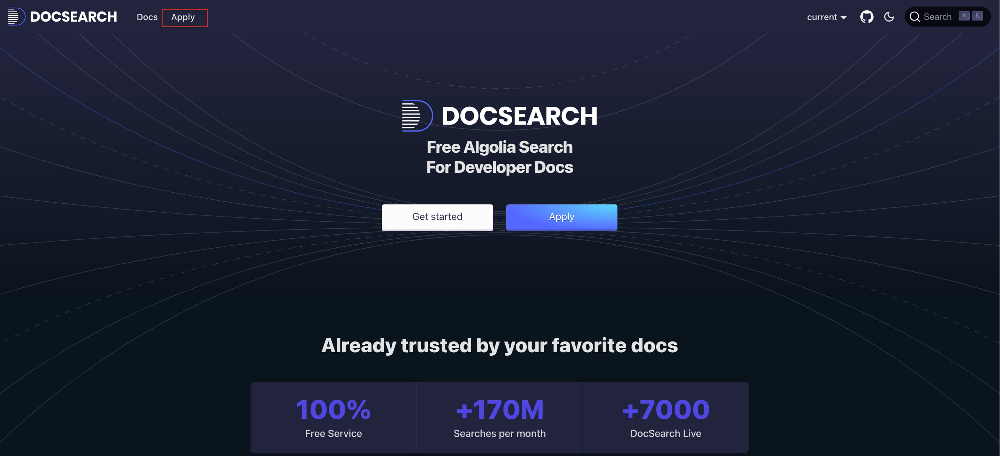
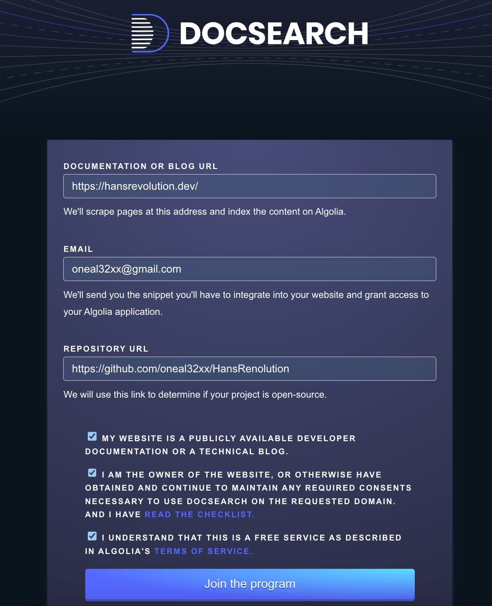
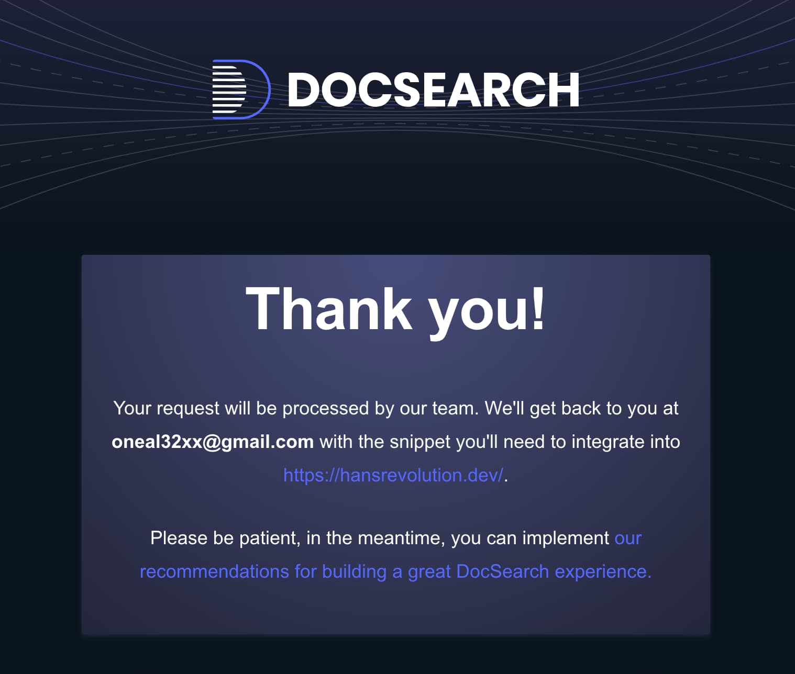
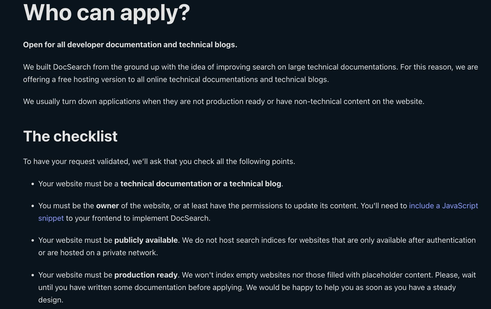
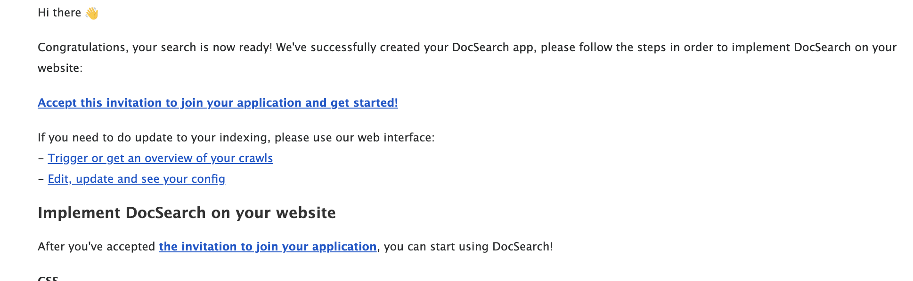
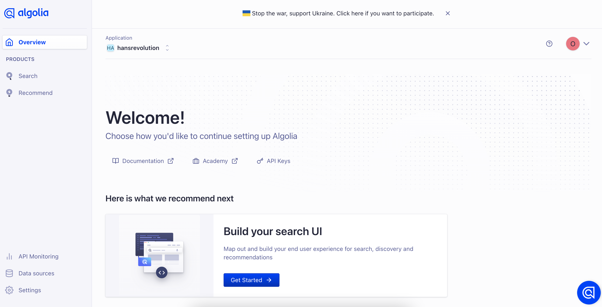

import Image from '@theme/IdealImage';
import Algolia07 from './Algolia07.png';
import CaptionWrapper from "@site/src/components/CaptionWrapper";

## Docusaurus 使用 Algolia DocSearch

### 到 Algolia DocSearch 遞交申請

首先進去 Algolia DocSearch 的主頁，點選左上方 Apply 進去申請頁面

- [Algolia DocSearch](https://docsearch.algolia.com/)
  


填上`個人網站的網址`、`Email`、以及`個人網站 Github Repo 網址`，最後點選 `Join the program`


申請成功畫面如下，接著就等待 Algolia 的審核信吧



 另外 Algolia 申請是有條件的，申請前必須先注意，官方網站有提供 [checklist](https://docsearch.algolia.com/docs/who-can-apply) 如下圖

- 網站內容必須是技術相關
- 必須是網站的擁有者，而且有權限可以運用 JavaScript snippet 修改網站
- 網站必須是可以公開存取的，原因是 Algolia 每週會來爬你的網站，如果你的網站內容是需要驗證登入才看得到，那 Algolia 也沒辦法爬到你網站的內容
- 你的網站已經上線了一段時間，而且必須有一些內容了，因為 Algolia 來爬你的網站的時候，總不能內容是空空的吧？！



### 等待 Algolia 寄送審核成功信件

申請成功之後，就會收到 Algolia 寄發的審核成功信，連結給他點下去，照著 Algolia提供的步驟，就可以進入 Algolia DashBoard，到這邊基本上就完成一半了！




接著我們參考 Docusaurus 官方的 [Connecting Algolia](https://docusaurus.io/docs/search#connecting-algolia) 設定教學，在`docusaurus.config.js` 的`themeConfig` 新增 `algolia` 設定，設定完之後網站的查詢功能就正式啟用了，是不是非常簡單！


```javascript title="docusaurus.config.js" showLineNumbers

(module.exports = {
module.exports = {
  // ...
  themeConfig: {
    // ...
    algolia: {
      // The application ID provided by Algolia
      appId: 'YOUR_APP_ID',

      // Public API key: it is safe to commit it
      apiKey: 'YOUR_SEARCH_API_KEY',

      indexName: 'YOUR_INDEX_NAME',

      // Optional: see doc section below
      contextualSearch: true,

      // Optional: Specify domains where the navigation should occur through window.location instead on history.push. Useful when our Algolia config crawls multiple documentation sites and we want to navigate with window.location.href to them.
      externalUrlRegex: 'external\\.com|domain\\.com',

      // Optional: Replace parts of the item URLs from Algolia. Useful when using the same search index for multiple deployments using a different baseUrl. You can use regexp or string in the `from` param. For example: localhost:3000 vs myCompany.com/docs
      replaceSearchResultPathname: {
        from: '/docs/', // or as RegExp: /\/docs\//
        to: '/',
      },

      // Optional: Algolia search parameters
      searchParameters: {},

      // Optional: path for search page that enabled by default (`false` to disable it)
      searchPagePath: 'search',

      //... other Algolia params
    },
  },
};
```

### 試試 Algolia DocSearch 查詢功能

我們按下 `command + K`，就可以看到 Algolia 的 Search UI 彈了出來，接著輸入 `jwt` 來查詢我們最近寫的[如何在 Net 7 Web api 專案使用 JWT 驗證授權](../net/net7_webapijwt.md)，就可以很快的查詢到包含 JWT 的相關文章！

<CaptionWrapper caption="實際使用 Algolia DocSearch 查詢功能">
<Image img={Algolia07} alt="實際使用 Algolia DocSearch 查詢功能"/>
</CaptionWrapper>