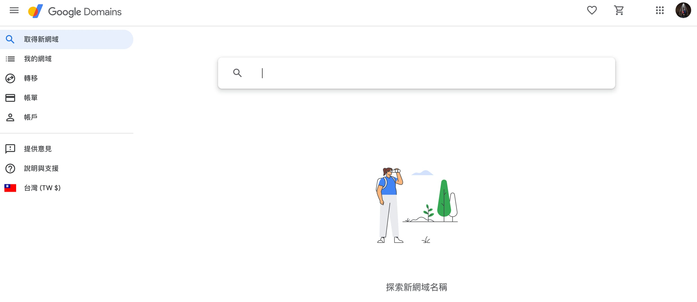
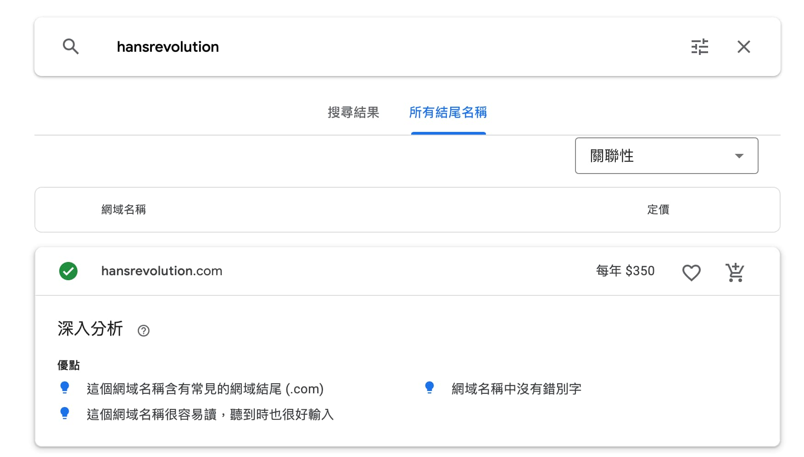
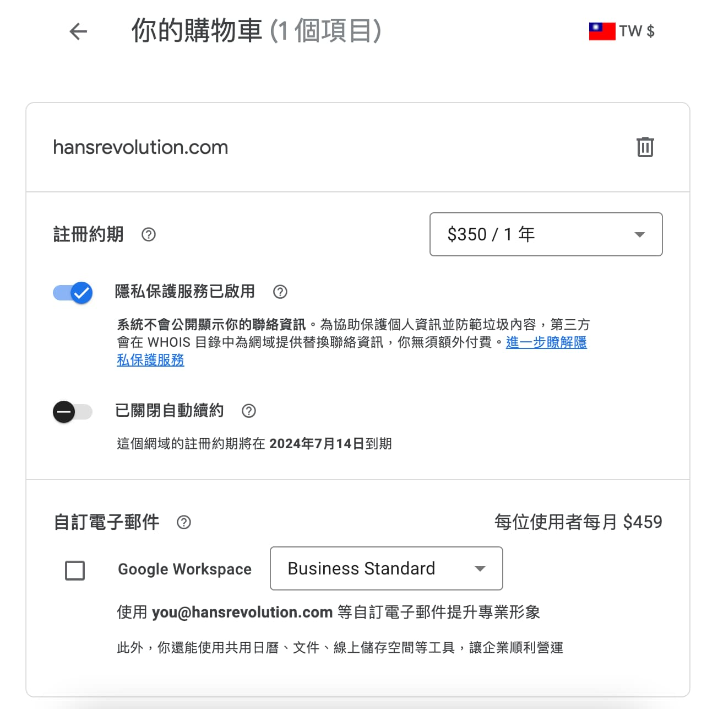
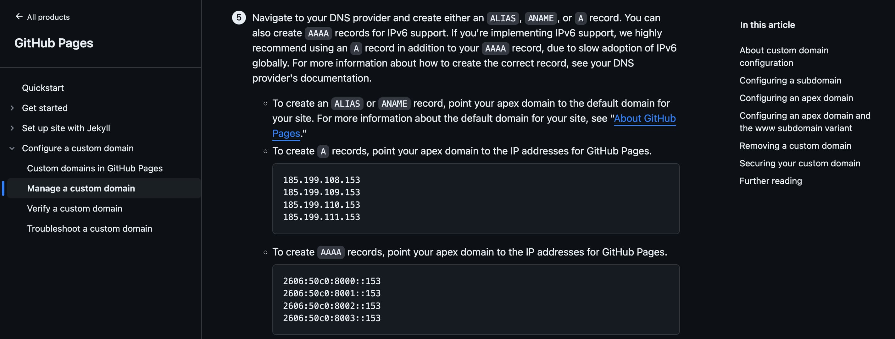
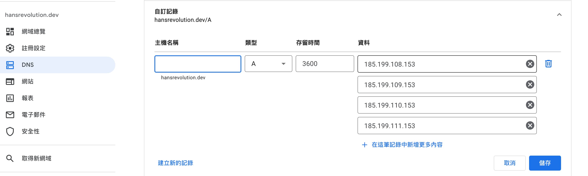
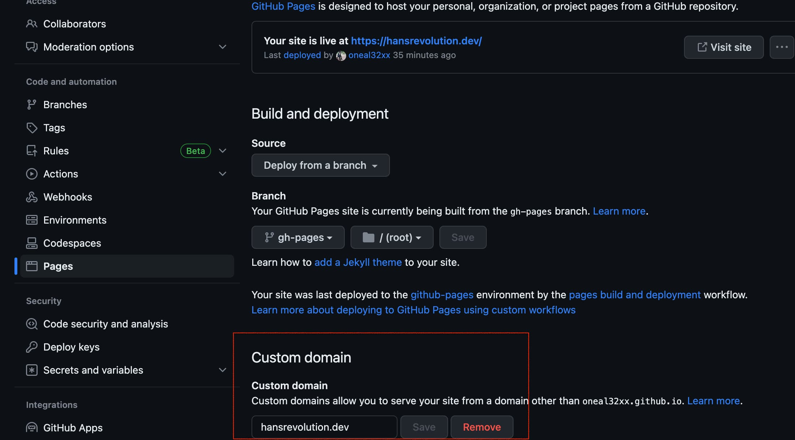
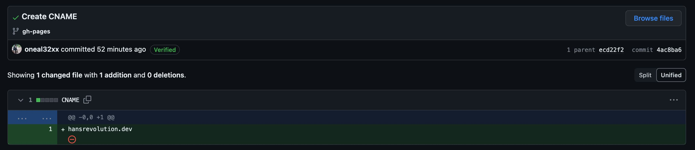

## 基本設定

基本設定都在資料夾根目錄的 `docusaurus.config.js` 檔案裡，包含 title、tagline、url、favicon等等.
像我們設定`title: 'Hans-Revolution'`，一進首頁就會有Hans-Revolution的標題呈現在我們眼前

```javascript title="docusaurus.config.js" showLineNumbers 
(module.exports = {
  title: 'Hans-Revolution',
  tagline: '技術筆記、生活記事',
  url: 'https://oneal32xx.github.io',
  baseUrl: '/HansRenolution/',
  onBrokenLinks: 'throw',
  onBrokenMarkdownLinks: 'warn',
  favicon: 'img/HansRev.ico',
  organizationName: 'oneal32xx', // Usually your GitHub org/user name.
  projectName: 'HansRenolution', // Usually your repo name.
...
```

## 樣式設定

如果要客製化網站樣式，可以將CSS寫在 `src/css/custom.css` 檔案裡，
像是要設定`class=Home__text`在DarkMode時的樣式，就可以用 `html[data-theme='dark']`當作前綴，
網站切換成DarkMode時，就會讀取這段的樣式

```css title="src/css/custom.css" showLineNumbers 
.Home__text{
  font-family: Microsoft JhengHei;
  font-weight: bold;
  text-shadow: shadow1, shadow2, shadow3;
  text-shadow: 2px 2px 0px rgba(0,0,0,0.6), 4px 4px 0px rgba(255, 255, 255, 0.5);
}

html[data-theme='dark'] .Home__text{
  text-shadow: shadow1, shadow2, shadow3;
  text-shadow: 2px 2px 0px rgba(255, 255, 255, 0.8), 4px 4px 0px rgba(0,0,0,0.15);
}

```

## 加入 Google Analytics

安裝 docusaurus Google Analytics plugin 套件
```bash
npm install --save @docusaurus/plugin-google-gtag
```

設定 docusaurus.config.js, trackingID 填入自己在 Google 申請的 Id 即可
```js title="docusaurus.config.js" showLineNumbers 
  module.exports = {
    plugins: [
      [
        '@docusaurus/plugin-google-gtag',
        {
          trackingID: 'G-999X9XX9XX',
          anonymizeIP: true,
        },
      ],
    ],
  };
```


## Docusaurus 版本升級


```bash
Update available 2.3.0 → 2.4.1 
To upgrade Docusaurus packages with the latest version, run the following command:  
`yarn upgrade @docusaurus/core@latest @docusaurus/plugin-google-gtag@latest @docusaurus/preset-classic@latest` 
```

## Docusaurus 使用 Google Domain & GitHub Pages 自定義網域

### Google Domain 申請及購買
首先到 Google Domain 收尋自己想要的域名


找到自己想要的網域結尾，就可以加入購物車去付款啦！


結帳的時候 Google 會跟你說 隱私保護服務已啟用，這部分直接打勾即可，接者就可以拿起你的魔法小卡給他刷下去了！
`隱私保護服務已啟用`
`系統不會公開顯示你的聯絡資訊。為協助保護個人資訊並防範垃圾內容，第三方會在 WHOIS 目錄中為網域提供替換聯絡資訊，你無須額外付費。`


### Google Domain DNS 設定 
購買完 Domain 之後就要將這個 Domain 指向 GitHub Pages，這邊需要參考 GitHub Docs 的文件，文件告訴我們要在 Google Domain 的 DNS 設定新增 A record，
如果要支援 IPv6，就要設定 AAAA records，我們這邊只需要設定 A record 就 OK 了

[GitHub Docs](https://docs.github.com/en/pages/configuring-a-custom-domain-for-your-github-pages-site/managing-a-custom-domain-for-your-github-pages-site)



### GitHub Pages 設定 
接下來我們要把現有的Github Pages 掛上我們的購買的網域名，只要到 Repository 的 Setting ，裡頭的 Pages 設定 Custom domain，將我們剛剛的設定的網域名設定進去，就完成啦！


### Docusaurus 專案 static 資料夾建立 CNAME 檔案
在設定完 Custom domain 之後，GitHub 會自動將 CNAME 產生並推送到我們的 depoly Repository，文件裡面就是我們剛剛設定的網域名稱，要特別注意的是
這個檔案必須手動建立在我們 Docusaurus 專案裡面的 `static` 資料夾，這樣下次我們在 build 新版的時候，CNAME 檔案才會一併被產生，Custom domain 的設定才不會跑掉

